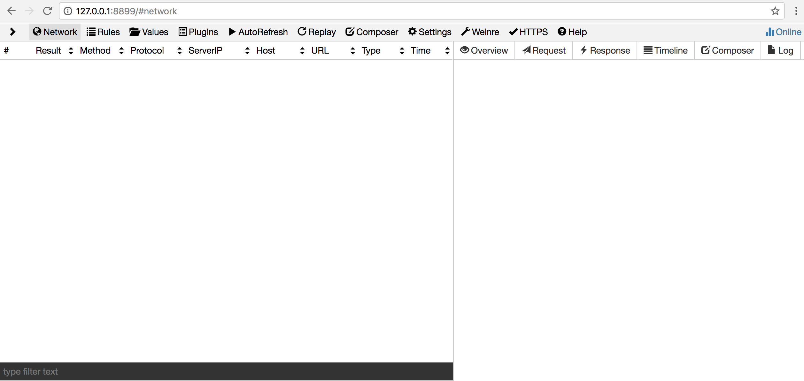
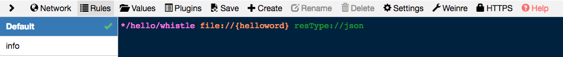
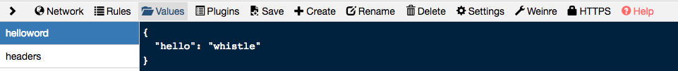
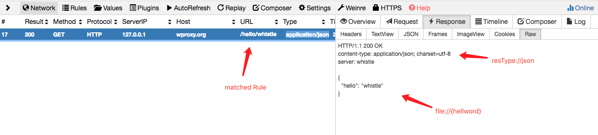
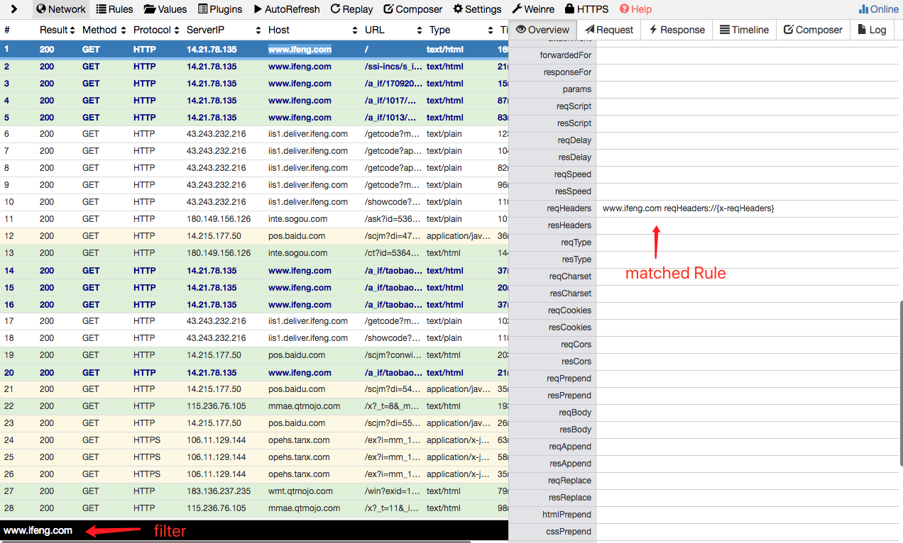
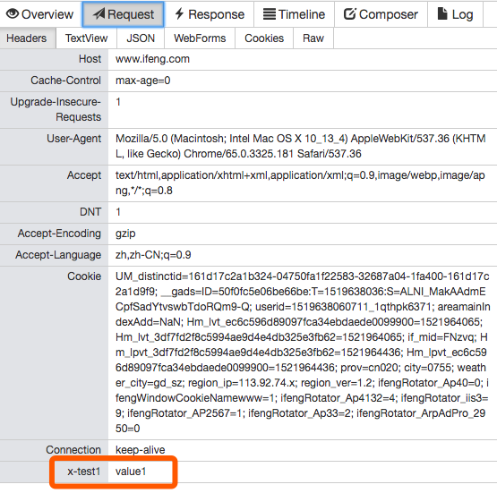
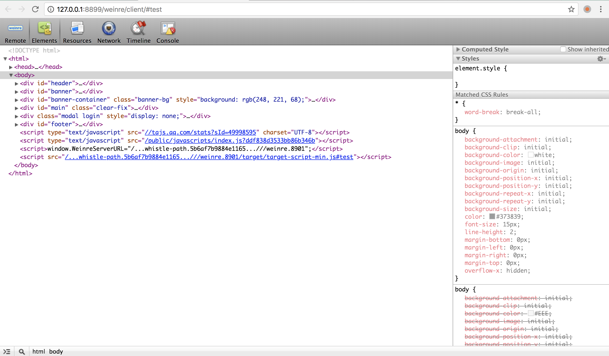
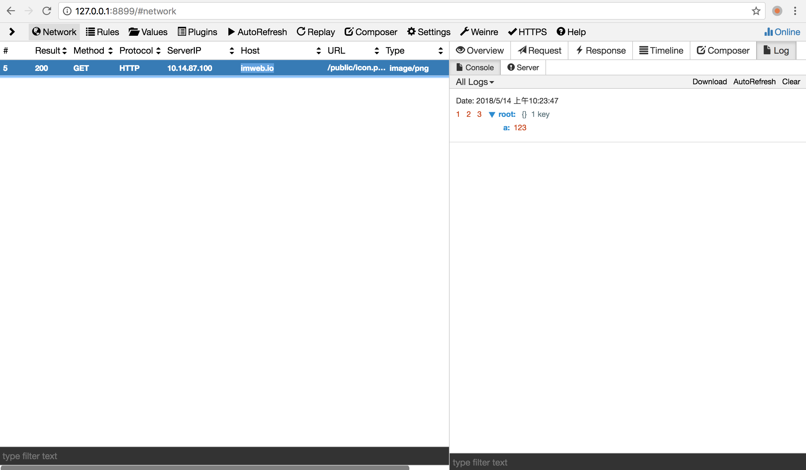

<p align="center">
  <a href="https://avwo.github.io/whistle/">
    
  </a>
</p>

# whistle
[](http://nodejs.org/download/)
[](https://travis-ci.org/avwo/whistle)
[](https://codecov.io/gh/avwo/whistle)
[](https://npmjs.org/package/whistle)
[](https://www.npmjs.com/package/whistle)
[](https://www.npmjs.com/package/whistle)

[README in English](README.md)

whistle(读音`[ˈwɪsəl]`，拼音`[wēisǒu]`)是基于Node实现的跨平台调试代理工具。

它提供了如下基本功能：

1. 完全跨平台，支持Windows、Mac、Linux、Unix的桌面及命令行系统
2. 支持抓包、改包、调试HTTP、HTTPS、WebSocket及Socket请求
3. 内置weinre，支持在PC上查看修改移动端网页的DOM结构
4. 内置[Log](https://avwo.github.io/whistle/webui/log.html)，支持自动捕获页面JS异常及显示 `console.xxx` 的打印数据
5. 操作简单，有丰富的界面操作功能，所有的调试操作均可在界面上通过配置类似hosts的方式实现（详情参考[pattern operatorURI](https://avwo.github.io/whistle/pattern.html)）
6. 支持导出抓包数据为txt、saz文件格式，及导入txt、saz、har文件
7. 支持通过插件扩展，每个插件对应一个Node模块

**动图演示**


## 安装和启动
1. 安装Node：

   [点击下载](https://nodejs.org/en/download/)(推荐v6版本以上)

2. 安装whistle：

   ```shell
   npm i -g whistle
   ```

   > Mac或Linux可能需要使用管理员权限：`sudo npm i -g whistle`

3. 启动whistle：

   ```shell
   w2 start
   ```

   > 安装完成后，可执行命令`w2 help`查看帮助信息。

4. 配置代理：

   配置代理到`127.0.0.1:8899`即可，具体请参考：[帮助文档](http://wproxy.org/whistle/install.html)

5. 安装证书：

   安装根证书及开启https拦截后才可以正常操作或抓取https及websocket请求，具体参见：[安装根证书](https://avwo.github.io/whistle/webui/https.html)

6. 访问Web界面

   whistle的使用采用了web界面，从而只需要一个浏览器就能随意访问，不会受到操作系统平台影响，甚至可以直接远程访问，相当的方便。在浏览器中输入: `http://127.0.0.1:8899`，就能看到whistle的界面了。如果有任何异常，请先参考[常见问题](http://wproxy.org/whistle/questions.html)。



## 名词解释
> 在使用whistle之前，有必要了解一下这几个名词概念：Rule， Value 和 Protocol

**Rule**格式为：<目标规则> <响应操作1> ... <响应操作n> 

其作用是寻找满足指定规则的url，对其请求、响应进行操作，包括修改http请求的header、content，http响应的header、content、状态码等等，这些不同的响应操作，whistle按照类型将其分类，称之为**Protocol**，不同的Protocol可以在同一个Rule中同时配置。更多Protocol，请移步[协议列表](http://wproxy.org/whistle/rules/)。 

**Value** 是一个非常便利的特色功能。可以认为是whistle本身提供的一个key-value数据库，通过在Rule中直接使用{key}引入实际的Value内容，而不需要提供本地文件路径。对于Value的管理，请看[这里](http://wproxy.org/whistle/webui/values.html)。

## 常用标签

> 在顺利打开 http://127.0.0.1:8899 之后，看到的页面即whistle的Web界面，通过切换不同的菜单标签来实现日常操作。

这里先简单介绍几个常用的标签：Network，Rules，Values，以及HTTPS。

**Rules** 和 **Values** ，即分别为Rule和Value的管理界面。

**Network**则是经过whistle代理的流量。成功[配置http代理](http://wproxy.org/whistle/install.html)之后，可以看到Network面板开始忙碌了起来，一条条请求在不断刷屏。这时我们可以通过Filter来减少界面上展示的内容，也可通过**Settings**来设置*filter*（详情参考[这里](http://wproxy.org/whistle/webui/settings.html)）。点击任意一个请求，都可以在右侧面板中看到详情，如请求内容、回包内容、请求连接耗时、console日志等，也可以通过*Composer*来捏造请求，通过*Replay*来多次重复某一请求。

也许你会发现，对于**HTTPS**请求，浏览器会给出”不安全”的访问提示，这是因为还没有安装whistle的CA根证书，请参照[这里](http://wproxy.org/whistle/webui/https.html)，对应不同平台进行安装。安装成功之后，重启浏览器即可正常监听本地的https流量。

更多标签功能请参考[界面功能](http://wproxy.org/whistle/webui/)。

## 开始使用

> 接下来通过几个简单示例来了解whistle的一些主要功能。每个示例都是独立的，读者可以根据需要选择性阅读。

#### 示例1：mock数据

1. 首先，在**Rules**面板修改Default分组内容为```*/hello/whistle file://{helloword} resType://json```，其中`*/hello/whistle` 为目标规则，`file:` 和 `resType:` 为Protocol，`{helloword}`为Value。

   

2. 其后在Values面板中，新建一个key为helloword的Value：

   

3. 最终，该示例的效果就是，对于匹配成功的http请求，使用*hellowold*这个**value**作为http响应，并修改http header的Content-Type字段为`application/json`，最后直接返回给浏览器。我们会发现，`http://wproxy.org/hello/whistle `是捏造的一个URL地址，但是通过whistle的Rule将该请求拦截并成功进行修改。



#### 示例2：修改hosts并过滤请求

1. 在**Rules**面板修改Default分组内容为：

   ```
   www.test.com 127.0.0.1:8080 filter:///aa/i filter://!bb
   ```

2. 访问`www.test.com`，即可把url中包含aa、不包含bb的请求转发到本地8080端口，其中[filter](http://wproxy.org/whistle/rules/filter.html)支持正则表达式和取非语法。

   > 更过host配置详情可参考[文档](http://wproxy.org/whistle/rules/host.html)

#### 示例3：修改请求头部

1. 在**Rules**面板修改Default分组内容为：

   ```
   www.test.com reqHeaders://{x-reqHeaders}
   ```

   在**Values**面板中，新建一个key为x-reqHeaders的Value：

   ```
   x-test1: value1
   ```

2. 打开一个新的浏览器标签并访问 www.test.com，此时可以看到Network面板中，www.test.com 的浏览记录字体被加粗显示，在右侧的Overview面板中可以通过自定义header看到其命中的是哪一个Rule，也可以在Request面板中看到新添加的`x-test1`请求头。当然，Values面板只是为我们提供一个方便的在线的内容管理，我们也可以将内容保存到本地文件，再进行映射（参考[这里](http://wproxy.org/whistle/rules/rule/file.html)）。




#### 示例4：本地文件替换

1. 在**Rules**面板修改Default分组内容为：

   ```
   # Mac、Linux
   www.test.com file:///User/username/test

   # Windows的路径分隔符可以用 \ 或者 /
   www.test.com file://E:\xx\test
   ```

2. 访问`http://www.test.com/`时whistle会先尝试加载`*/test`这个文件，如果不存在，则会默认加载`*test/index.html`，如果没有对应的文件则返回404。

   > 也可以替换jsonp请求，具体参见：[tpl](rules/rule/tpl.html)

#### 示例5：修改请求、响应数据

1. 在**Rules**面板修改Default分组内容为：

   ```
   www.test.com/cgi-bin/get-data reqMerge://(a=1&b=2) resMerge://()
   ```

   在**Values**面板中，新建一个key为`test.json`的Value：

   ```json
   {
     "name": "avenwu",
     "obj": {
       "test": 1,
       "new": 2 
     }
   }
   ```

2. 当访问GET请求 `https://www.test.com/cgi-bin/get-data?x=2&a=0`时，会被whistle替换成 `https://www.test.com/cgi-bin/get-data?x=2&a=1&b=2`，**reqMerge**详情可参考[这里](http://wproxy.org/whistle/rules/reqMerge.html)。

3. 如果响应类型为 `application/json`，且返回内容为```{"name":"test","obj":{"test":"hehe"}}```，则经过whistle后在浏览器会收到```{"name": "avenwu","obj":{"test":"hehe","new":2}}```，**resMerge**详情可参考[这里](http://wproxy.org/whistle/rules/resMerge.html)。

#### 示例6：注入html、js、css

1. 在**Rules**面板修改Default分组内容为：

   ```
   # Mac、Linux
   www.test.com htmlAppend:///User/xxx/test/test.html jsAppend:///User/xxx/test/test.js cssAppend:///User/xxx/test/test.css

   # Windows的路径分隔符可以用`\`和`/`
   www.test.com htmlAppend://E:\xx\test\test.html ://E:\xx\test\test.js cssAppend://E:\xx\test\test.css
   ```

2. 所有www.test.com域名下的请求，whistle都会根据响应类型，将处理好的文本注入到响应内容里面，具体追加规则如下：

   |          | htmlAppend |      jsAppend      |     cssAppend     |
   | -------- | :--------: | :----------------: | :---------------: |
   | html请求 |  直接追加  | <script>包裹后追加 | <style>包裹后追加 |
   | js请求   |     -      |      直接追加      |         -         |
   | csss请求 |     -      |         -          |     直接追加      |

   > whistle会自动根据响应内容的类型，判断是否注入相应的文本及如何注入(是否要用标签包裹起来)，详情参考[htmlAppend](http://wproxy.org/whistle/rules/htmlAppend.html)、[jsAppend](http://wproxy.org/whistle/rules/jsAppend.html)、[cssAppend](http://wproxy.org/whistle/rules/cssAppend.html)。

#### 示例7：调试远程页面

> 利用whistle提供的[weinre](rules/weinre.html)和[log](rules/log.html)两个协议，可以实现修改远程页面DOM结构及自动捕获页面js错误及console打印的信息，还可以在页面顶部或js文件底部注入指定的脚步调试页面信息。注意，无论是手机，还是PC，都需要将代理设置到whistle。

**weinre**

1. 在**Rules**面板修改Default分组内容为：

   ```
   imweb.io weinre://test
   ```

2. 配置后保存，打开`www.test.com`，鼠标放在菜单栏的weinre按钮上会显示一个列表，并点击其中的**test**项打开weinre的调试页面选择对应的url切换到Elements即可。

   

**log**

1. 在**Rules**面板修改Default分组内容为：

   ```
   imweb.io log://{test.js}
   ```

2. 配置后保存，鼠标放在菜单栏的Values按钮上会显示一个列表，并点击其中的`test.js`项，whistle会自动在Values上建立一个test.js分组，在里面填入`console.log(1, 2, 3, {a: 123})`保存，打开Network -> 右侧Log -> Console，再打开[www.test.com](http://www.test.com/)，即可看到Log下面的Page输出的信息。

   

> 除了上述功能，whistle能做的事情还有很多，比如：使用[urlParams](http://wproxy.org/whistle/rules/urlParams.html)和[tpl](http://wproxy.org/whistle/rules/rule/tpl.html)更加灵活地修改请求和响应；支持[socks代理](http://wproxy.org/whistle/rules/socks.html)和[pac](http://wproxy.org/whistle/rules/pac.html)；提供[websocket](http://wproxy.org/whistle/webui/websocket.html)的调试功能。如果这些功能还无法满足你的需求，那可以考虑开发插件([Plugins](http://wproxy.org/whistle/webui/plugins.html))来实现更多自定义的功能。

### 功能全景如下：


# License
[MIT](https://github.com/avwo/whistle/blob/master/LICENSE)
